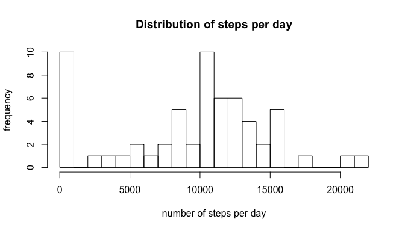
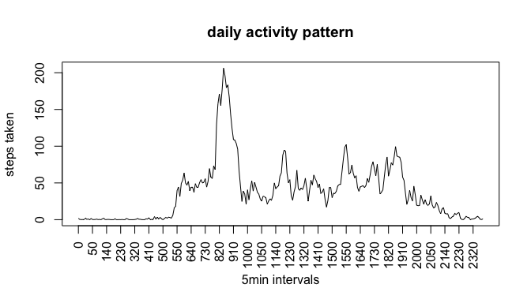
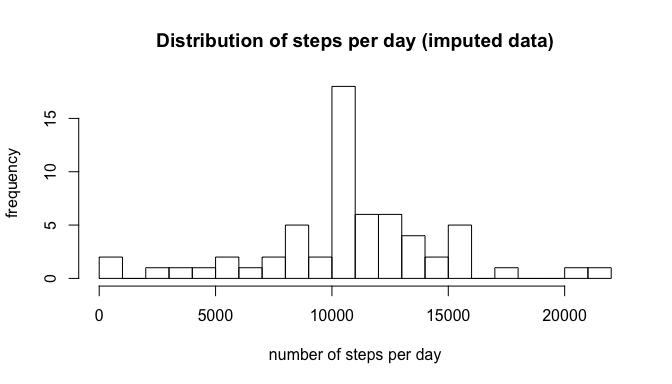
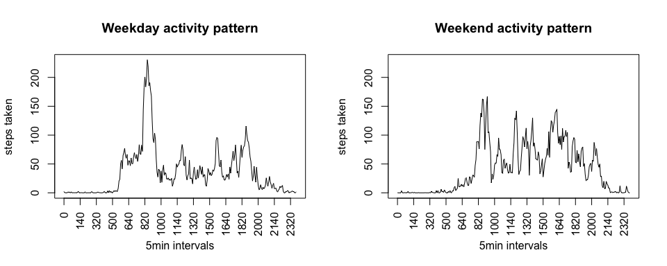

# Reproducible Research: Peer Assessment 1


## Loading and preprocessing the data
Assuming the data has been downloaded in the current directory, the data is loaded and the date column is transformed to a factor variable. We keep a copy of the original data.  

```r
data_orig<-read.csv('activity.csv')
data_orig<-transform(data_orig,date=as.factor(date))
data<-data_orig
```

## What is mean total number of steps taken per day?

We sum the steps per date factor level, ignoring NA entries, and plot a histogram of the step distribution.


```r
totalperday<-tapply(data$steps,data$date,sum,na.rm=TRUE)
hist(totalperday,20,xlab = "number of steps per day",ylab = "frequency",main = "Distribution of steps per day")
```

 

```r
mean_withoutna<-mean(totalperday)
median_withoutna<-median(totalperday)
```

Its mean is $9354.2295082$ and its median is $10395$.  

## What is the average daily activity pattern?

We use the interval IDs as another factor variable, compute the average number of steps per interval, again omitting NA entries, and visualize the activity pattern as a line plot connecting steps per interval over the course of the day.


```r
data<-transform(data,interval=as.factor(interval))
avgperinterval<-tapply(data$steps,data$interval,mean,na.rm=TRUE)
plot(avgperinterval,type='l',xaxt = 'n',xlab="5min intervals",ylab="steps taken",main="daily activity pattern")
n=names(avgperinterval)
axis(1,at=seq(1,nrow(avgperinterval),10),labels=n[seq(1,length(n),10)],las=2)
```

 

```r
max_interval <-which.max(avgperinterval)
avgperinterval[max_interval]
```

```
##      835 
## 206.1698
```

Interval $835$ contains the maximum average number of steps $206.1698113$. 


## Imputing missing values


```r
nas<-is.na(data$steps)
nummissingvals<-sum(nas)
```

The dataset contains 2304 missing values in the steps column.
We choose to fill the missing values by replacing them with the average number of steps per corresponding interval, as computed above; the idea being that we would like to preserve the daily activity pattern as much as possible.
We create a dataframe that will serve as lookup table, containing the above computed averages and their associated interval IDs. We then loop over the original data set and replace the NA values with the rounded averages per interval. A for loop has been chosen here since the use of tapply and merge was neither simpler nor faster.

```r
data_interp<-data.frame(avgperinterval,as.integer(rownames(avgperinterval)))
names(data_interp)[2]<-"interval"
for(i in 1:nrow(data_orig)){
  if (is.na(data_orig[i,1])){
    index = which(data_interp$interval==as.numeric(data_orig[i,3]));
    data_orig[i,1]=round(data_interp[index,1]);
  }
}
```

We again sum the steps per date factor level, this time with imputed NA values, and plot a histogram of the step distribution.


```r
totalperday_interp<-tapply(data_orig$steps,data_orig$date,sum)
hist(totalperday_interp,20,xlab = "number of steps per day",ylab = "frequency",main = "Distribution of steps per day (imputed data)")
```

 

```r
mean_withna<-mean(totalperday_interp)
median_withna<-median(totalperday_interp)
```

Its mean is $1.0765639\times 10^{4}$ and its median is $1.0762\times 10^{4}$. By imputing the missing values, the mean has changed by $1411.4098361$ and the median by $367$. It appears that the median is more robust towards imputing values than the mean for the chosen filling strategy.

## Are there differences in activity patterns between weekdays and weekends?

We add a new factor variable to the original, but imputed, dataset. We choose a universal locale and use the timeDate library function isWeekday to assign each entry a weekend or weekday factor.


```r
curr_locale <- Sys.getlocale("LC_TIME")
Sys.setlocale("LC_TIME","en_US.UTF-8")
```

```
## [1] "en_US.UTF-8"
```

```r
d<-as.Date(data_orig$date)
library(timeDate)
w<-isWeekday(d, wday=1:5)
data_orig$weekday <- factor(w, levels=c(FALSE, TRUE), labels=c('weekend', 'weekday')) 
```

We again compute the average steps on the imputed dataset, this time on two factor levels interval and weekday, and plot the activity pattern as a line plot over intervals for weekend and weekdays separately.


```r
avgperinterval2<-tapply(data_orig$steps,list(data_orig$interval,data_orig$weekday),mean)
par(mfrow = c(1,2)) 
plot(avgperinterval2[,'weekday'],type='l',xaxt = 'n',xlab="5min intervals",ylab="steps taken",main="Weekday activity pattern",ylim=range(avgperinterval2))
axis(1,at=seq(1,nrow(avgperinterval2),20),labels=n[seq(1,length(n),20)],las=2)
plot(avgperinterval2[,'weekend'],type='l',xaxt = 'n',xlab="5min intervals",ylab="steps taken",main="Weekend activity pattern",ylim=range(avgperinterval2))
axis(1,at=seq(1,nrow(avgperinterval2),20),labels=n[seq(1,length(n),20)],las=2)
```

 

```r
Sys.setlocale("LC_TIME",curr_locale)
```

```
## [1] "de_DE.UTF-8"
```

It appears from the activity patterns that the test subject did move less during office hours, but attained peak activity during morning commutes on weekdays; weekend activity started later and ended later than on weekdays.
